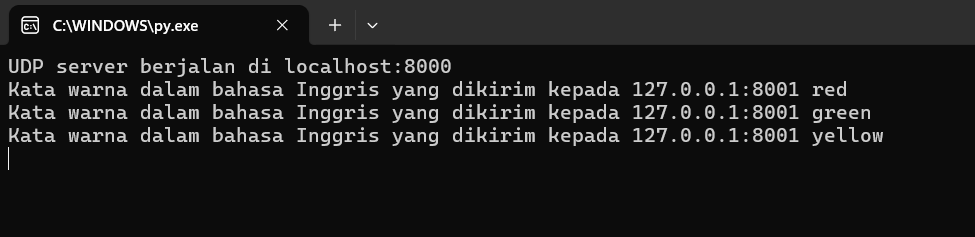
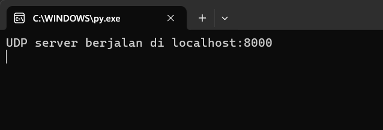
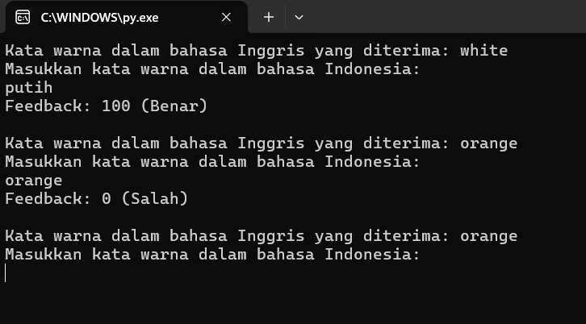
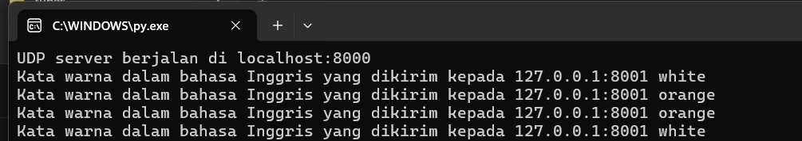
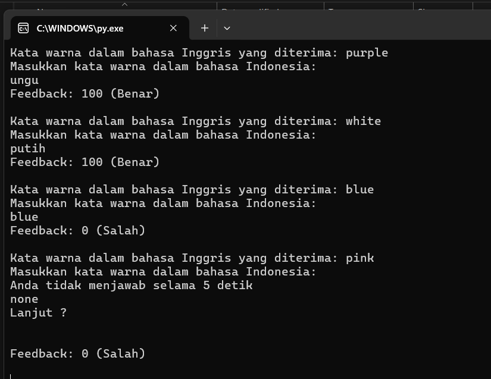
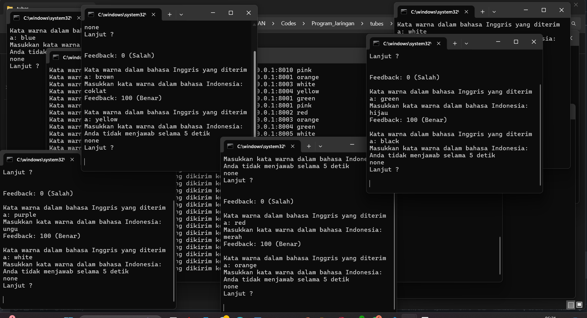

# UTS Pemrograman Web

## Identitas
- Nama: Elan Agum Wicaksono
- NIM: 1203220005

## Deskripsi Soal
Buatlah sebuah permainan yang menggunakan soket dan protokol UDP. Permainannya cukup sederhana, dengan 1 server dapat melayani banyak klien (one-to-many). Setiap 10 detik, server akan mengirimkan kata warna acak dalam bahasa Inggris kepada semua klien yang terhubung. Setiap klien harus menerima kata yang berbeda (unik). Selanjutnya, klien memiliki waktu 5 detik untuk merespons dengan kata warna dalam bahasa Indonesia. Setelah itu, server akan memberikan nilai feedback 0 jika jawabannya salah dan 100 jika benar.

## Penjelasan kode
**server.py**.
```python
import socket
import random
import time
import threading

# Daftar kata warna dalam bahasa Inggris dan terjemahannya dalam bahasa Indonesia
colors = ['red', 'blue', 'green', 'yellow', 'orange', 'purple', 'pink', 'brown', 'white', 'black']

# Membuat UDP socket
server_socket = socket.socket(socket.AF_INET, socket.SOCK_DGRAM)

# Bind socket ke alamat dan port
server_address = ('localhost', 8000)
server_socket.bind(server_address)

print("UDP server berjalan di {}:{}".format(*server_address))

def handle_client(client_address):
    while True:
        try:
            # Memilih kata warna acak dalam bahasa Inggris
            random_color_en = random.choice(colors)

            # Mengirimkan kata warna acak kepada klien yang terhubung
            message = "Kata warna dalam bahasa Inggris: {}".format(random_color_en)
            server_socket.sendto(message.encode(), client_address)

            print("Kata warna dalam bahasa Inggris yang dikirim kepada {}:{}".format(*client_address), random_color_en)
            
            # Menunggu 10 detik sebelum mengirim kata warna baru
            time.sleep(10)

        except Exception as e:
            print("Error:", e)
            break

# Fungsi untuk menerima koneksi dari klien
def accept_connections():
    while True:
        try:
            # Menerima koneksi dari klien
            data, client_address = server_socket.recvfrom(1024)

            # Tambahkan alamat klien ke set klien yang terhubung
            connected_clients.add(client_address)

            # Tangani klien dalam thread terpisah
            client_thread = threading.Thread(target=handle_client, args=(client_address,))
            client_thread.start()

        except Exception as e:
            print("Error:", e)
            break

# Set klien yang terhubung
connected_clients = set()

# Mulai menerima koneksi dari klien dalam thread terpisah
connection_thread = threading.Thread(target=accept_connections)
connection_thread.start()

# Tunggu hingga semua thread selesai
connection_thread.join()

# Tutup soket
server_socket.close()
```
#### Output:


#### Server:
1. Pertama kita akan meng-import 4 modul yang akan digunakan yaitu `socket`,`random`,`time`,`threading`. 
2. Selanjutnya kita membuat variabel array `colors` yang berisi warna - want yang akan dikirim server ke client
3. Dilanjutkan dengan membuat socket UDP.
4. Kemudaian menyambungkan socket ke alamat dan port tertentu. disini kita menggunakan alamat = 'localhost' dan host = 8000
5. Selanjutnya terdapat fungsi `handle_client` yang digunakan untuk memilih warna secara random didalam variabel `colors` dengan bantuan modul random. Fungsi ini juga nanti akan mengirim warna yang telah ditentukan ke client
6. Selanjutnya fungsi `accept_connection`yang digunakan untuk menjalin hubungan antara server dan client. Fungsi ini akan menerima koneksi dari client dan menambahkannya ke list client yang sedang terhubung ke client. Didalam fungsi ini terdapat thead `client_thread` yang digunakan oleh server agar dapat melakukan koneksi ke beberapa client secara bersamaan.

**client.py**.
```python
import socket
import time
import threading

# Daftar kata warna dalam bahasa Inggris dan terjemahannya dalam bahasa Indonesia
colors = {
    "red": "merah",
    "green": "hijau",
    "blue": "biru",
    "yellow": "kuning",
    "orange": "jingga",
    "purple": "ungu",
    "pink": "merah muda",
    "brown": "coklat", 
    "white": "putih", 
    "black": "hitam"
}

# Membuat UDP socket
client_socket = socket.socket(socket.AF_INET, socket.SOCK_DGRAM)

# Bind socket ke alamat dan port
client_address = ('localhost', 8001)
client_socket.bind(client_address)

while True:
    try:
        def input_with_timeout(prompt ,timeout):
            print(prompt)
            response = [None]  # Response will be stored here
            def input_thread():
                try:
                    response[0] = input()
                except Exception as e:
                    print(e)

            thread = threading.Thread(target=input_thread)
            thread.start()
            thread.join(timeout)

            if thread.is_alive():
                print(f"Anda tidak menjawab selama {timeout} detik")
                print("none")
                print("Lanjut ?\n")
                thread.join()
                return None
            else:
                return response[0]

        # Mengirim pesan "connect" ke server
        client_socket.sendto(b'connect', ('localhost', 8000))

        # Menerima pesan dari server
        message, _ = client_socket.recvfrom(1024)
        message = message.decode()

        # Memisahkan kata warna dalam bahasa Inggris dari pesan
        _, random_color_en = message.split(": ")
        print("Kata warna dalam bahasa Inggris yang diterima:", random_color_en)

        # Meminta pengguna untuk memasukkan kata warna dalam bahasa Indonesia
        user_color_id = input_with_timeout("Masukkan kata warna dalam bahasa Indonesia: ",5)

        # Mendapatkan kata warna dalam bahasa Inggris yang sesuai
        correct_color_en = colors.get(random_color_en, "tidak ada")
        
        # Memberikan nilai feedback
        if correct_color_en == user_color_id:
            print("Feedback: 100 (Benar)\n")
        else:
            print("Feedback: 0 (Salah)\n")

    except KeyboardInterrupt:
        print("\nMenutup klien.")
        break

    # Menunggu 5 detik sebelum menerima pesan berikutnya dari server
    time.sleep(5)

# Menutup soket
client_socket.close()
```
#### Output:


#### Client:

1. MemImpor library socket, time, dan threading.
2. Definisikan kamus colors yang berisi kata warna dalam bahasa Inggris dan terjemahannya dalam bahasa Indonesia.
3. Buat objek socket UDP menggunakan socket.socket(socket.AF_INET, socket.SOCK_DGRAM).
4. Ikat socket ke alamat dan port localhost pada port 8001 menggunakan client_socket.bind(('localhost', 8001)).
5. Dalam loop utama while True:
   - Fungsi input_with_timeout digunakan untuk meminta masukan pengguna dengan batasan waktu. Jika pengguna tidak memberikan masukan dalam waktu yang ditentukan, fungsi akan mengembalikan None.
   - Mengirim pesan "connect" ke server menggunakan client_socket.sendto(b'connect', ('localhost', 8000)).
    - Menerima pesan dari server yang berisi kata warna dalam bahasa Inggris menggunakan client_socket.recvfrom(1024).
   -  Memisahkan kata warna dalam bahasa Inggris dari pesan menggunakan message.split(": ").
    - Meminta pengguna untuk memasukkan kata warna dalam bahasa Indonesia dengan batasan waktu 5 detik menggunakan fungsi input_with_timeout.
    - Memberikan nilai feedback berdasarkan jawaban pengguna. Jika jawaban benar, nilai feedback adalah 100, jika salah, nilai feedback adalah 0.
    - Menunggu 5 detik sebelum menerima pesan berikutnya dari server menggunakan time.sleep(5).
6. Setelah loop selesai, program menutup soket dengan client_socket.close().buat socket UDP.

## Cara Penggunaan
Untuk menjalankan kode kita bisa langsung menjalankannya di terminal VScode atau terminal python sendiri.
1. Pertama jalankan server.py

Diatas adalah kondisi awal server, server tidak akan berjalan sampai ada 1 client melakukan koneksi.

2. Selanjutnya jalankan client.py

Ketika client dijalankan server akan langsung mengirim warna kepada client


3. Pada bagian klien kita hanya perlu menginput warna yang diberikan server tetapi telah di translate ke bahasa Indonesia. Misal `White = putih` dan jika benar maka akan menampilkan feedback dengan nilai 100

4. Sebaliknya jika kita memasukka warna yang salah maka kita akan mendapatkan feedback dengan nilain 0


5. Kita juga dapat mengalami timeout apabila kita terlalu lama dalam mengisi inputan kita

## Cara Penggunaan dengan 10 client
Untuk mempermudah menjalankan 10 client secara langsung kita dapat membuat sebuah program pyhton `run.py`

Kita hanya perlu menjalankan kode `run.py` untuk menjalankan server + 10 client secara bersama.



>Keterangan
> - Dapat dilihat agak terlihat kacau ketika menjalankan 10 client secara bersamaan
> - Tapi pada dasarnya cara menjalankannya sama hanya saja kita memiliki 10 client yang sama - sama terhubung ke 1 server

